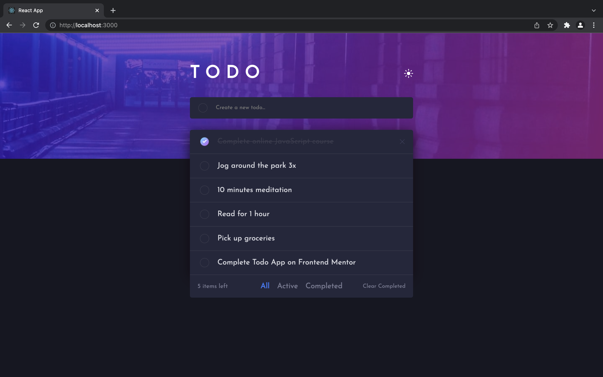
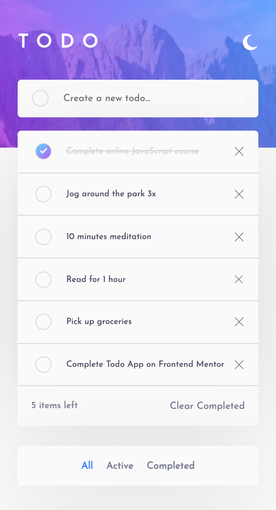

- [Todo app](#todo-app)
  - [Overview](#overview)
  - [Links](#links)
  - [How to run the project](#how-to-run-the-project)
  - [The challenge](#the-challenge)
  - [Description](#description)
  - [Features](#features)
  - [Technologies](#technologies)
  - [How I built this project](#how-i-built-this-project)
  - [Status](#status)
    - [Planned changes](#planned-changes)
  - [Sources](#sources)
  - [Useful references](#useful-references)

# Todo app

  
  
  
  <!-- 
   -->

 

## Overview

*This app will help you keep track of your tasks. Find them exactly the way you left them even when you reload the page or reopen the browser.*

  

 

## Links

<a href="/.github/README.md">GitHub repo</a> • <a href="/.github/CONTRIBUTING.md">Live demo </a> • <a href="/.github/PULL_REQUEST_TEMPLATE.md">Project board</a> • <a href="/.github/PULL_REQUEST_TEMPLATE.md">Issues</a> • <a href="/.github/PULL_REQUEST_TEMPLATE.md">Pull requests</a>

## How to run the project

1. ``git clone HTTPS_REPO_URL MY-FOLDER-NAME``
2. ``cd MY-FOLDER-NAME``
3. ``npm install``
4. `` npm start ``
5. visit ``http://localhost:8888``

 

## The challenge 

> Users should be able to:
> - View the optimal layout for the app depending on their device's screen size.
> - See hover states for all interactive elements on the page.
> - Add new todos to the list.
> - Mark todos as complete.
> - Delete todos from the list.
> - Filter by all/active/complete todos.
> - Clear all completed todos.
> - Toggle light and dark mode.
> - **Bonus**: Drag and drop to reorder items on the list.
>
> *[From Frontend Mentor](https://www.frontendmentor.io/challenges/todo-app-Su1_KokOW)*

 

## Description

I started building this project right before I began learning ``React.js``. It was a good opportunity to practice these skills on my own and use the best the library has to offer.

This app is my solution to the Todo app challenge on Frontend Mentor.

<figure style="text-align:center;">

<figcaption>Screenshot of the Todo App on mobile.</figcaption>
</figure>

## Features

- Add, update, and delete tasks as you go.
- Responsive interface.
- Light/dark theme.
- Accessible drag and drop to reorder tasks.

 

## Technologies

- ``React.js`` to build the UI and its functionalities with hooks and functional components.
- ``localstorage`` to store the tasks and their status.
- ``CSS Grids`` for the ``.tasks-state`` component's mobile/desktop styling.
- ``CSS variables`` to avoir repetitiveness in the code.
- ``flexbox`` for the layout.
- Semantic and accessible HTML5.
- Responsive layout.

 

## How I built this project

The web app relies on ``localStorage`` to store data in the browser. It doesn't use a server for the backend.

1. Start by structuring the page with semantic and accessible HTML.
   1. Check W3C compliance with the website or extension.
   2. Use MDN to make sure elements hierarchy is valid.
2. Style the page with a mobile-first approach.
3. Add functionality with React.js.

[Visit my portfolio site, to see how I managed the challenges I faced while building this app.](https://adf.dev)

## Status

This web app still needs a few improvements.

### Planned changes

- [ ] Add privacy consent popup.
- [ ] Add tests.
- [x] Add drag and drop feature.
- [ ] Add hover states.

[See the project board here.](https://github.com/AngeliqueDF/todo-app-frontend-mentor/projects)

## Sources

- [Todo app challenge on Frontend Mentor](https://www.frontendmentor.io/challenges/todo-app-Su1_KokOW). Frontend Mentor challenges help you improve your coding skills by building realistic projects.

## Useful references

- [How to use React beautiful drag and drop](https://egghead.io/lessons/react-create-and-style-a-list-of-data-with-react) this tutorial by one of the maintainers uses class components. Still it can be useful to understand how to setup React Beautiful Drag and Drop.

- [Finally this tutorial on freeCodeCamp definitely helped me complete the challenge.](https://www.freecodecamp.org/news/how-to-add-drag-and-drop-in-react-with-react-beautiful-dnd/)